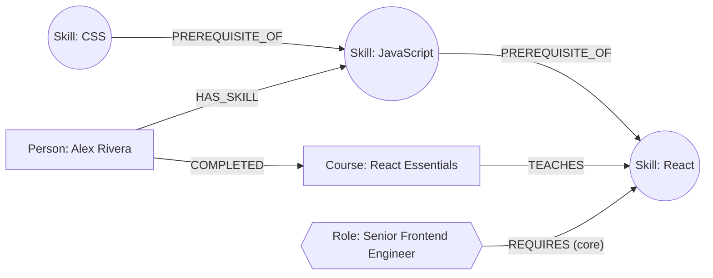

# Skill Atlas

A graph-backed app for exploring how skills, courses, and career roles connect — built on **CognoDB** (openCypher over Bolt) as the data layer.

Given a target skill, it traces every prerequisite that leads to it. Given a learner and a target role, it computes the skill gap and orders the missing skills into a learnable sequence. And it surfaces "bridge skills" — foundational skills that no role lists directly, but that quietly unlock several roles at once.

> Live demo: **\<add your hosted URL here\>**
> Screen recording: **\<add your recording link here\>**

---

## Why a graph database?

The core questions this app answers are all about *reachability through relationships*, not about looking up rows:

- **"What do I need to learn before I can learn React?"** — a prerequisite chain of unknown, variable depth. In Postgres this is a recursive CTE; in Cypher it's `(:Skill)-[:PREREQUISITE_OF*1..8]->(:Skill)`, one line.
- **"What's missing between what I know and what a role needs, and in what order should I learn it?"** — this joins a learner's current skills, a role's requirements, and the prerequisite graph *at the same time*, and the "order" itself depends on how many other missing skills still block each one. That's three relationship types composed in a single traversal.
- **"Which skills are hidden foundations that unlock the most roles, even though no role lists them directly?"** — an unbounded-depth reachability query, an anti-join, and a `HAVING`-style aggregate, combined. In SQL that's a recursive closure table, a `LEFT JOIN ... IS NULL`, and a `GROUP BY HAVING` stacked on top of each other. In Cypher it's one pattern match (see [Insights](#4-bridge-skills-the-hidden-foundations)).

None of these are natural relational-table questions — they're path questions. A graph database stores the relationships as first-class citizens, so "how are these connected, and how far apart are they" is the cheap operation instead of the expensive one. That's the whole argument for using CognoDB here instead of a normal Postgres schema with a `skill_id, prerequisite_id` join table.

---

## Data model

```
(:Skill {name, category})
(:Course {title, provider, hours})
(:Role {title, level})
(:Person {name, targetRole})

(:Skill)  -[:PREREQUISITE_OF]->      (:Skill)
(:Course) -[:TEACHES]->              (:Skill)
(:Role)   -[:REQUIRES {importance}]->(:Skill)
(:Person) -[:HAS_SKILL {level}]->    (:Skill)
(:Person) -[:COMPLETED]->            (:Course)
```



Seed data (`backend/src/seed.ts`): 30 skills across 6 categories, 29 prerequisite edges, 30 courses, 10 roles with weighted (`core` / `helpful`) requirements, and 2 demo learners with partial skill sets — small enough to read end-to-end, large enough that the traversals are non-trivial.

---

## Project structure

```
skill-atlas/
├── backend/                 Express API (TypeScript, run natively by Node — no build step)
│   ├── src/
│   │   ├── db.ts            CognoDB driver + connectivity check
│   │   ├── queries.ts       All Cypher, parameterised, one function per query
│   │   ├── types.ts         Shared row/DTO interfaces for query results
│   │   ├── seed.ts          Loads the seed data into a fresh instance
│   │   └── server.ts        Routes + error handling
│   └── .env.example
└── frontend/                React 19 (Vite + TypeScript) app
    └── src/
        ├── types.ts         DTOs mirroring the backend's types.ts
        ├── api.ts           Thin fetch wrapper for the backend
        └── components/
            ├── AtlasPage.tsx        graph explorer + prerequisite chain
            ├── PathFinderPage.tsx   skill gap + learning path
            ├── InsightsPage.tsx     bridge-skill query
            └── GraphCanvas.tsx      force-directed SVG rendering
```

---

## Setup

### 1. Create a CognoDB Cloud instance
1. Sign up at [console.cognodb.com/signup](https://console.cognodb.com/signup) (no credit card needed for the free tier).
2. Create a free **c0** instance and pick a region — it provisions in under a minute.
3. Copy the connection URI (`bolt+s://<instance-id>.databases.cognodb.cloud`) and the generated password for the `cognodb` user. **The password is shown once** — save it now.

### 2. Backend
```bash
cd backend
npm install
cp .env.example .env
# edit .env: paste in COGNODB_URI, COGNODB_USER=cognodb, COGNODB_PASSWORD
npm run seed     # loads the graph into your CognoDB instance
npm run dev       # starts the API on http://localhost:4000
```

### 3. Frontend
```bash
cd frontend
npm install
cp .env.example .env   # only needed if the API isn't on localhost:4000
npm run dev             # starts the app on http://localhost:5173
```

Open `http://localhost:5173`. If CognoDB is unreachable, the app shows a clear offline state instead of failing silently — try it by stopping the backend or entering a bad password.

---

## Main queries, explained

### 1. Prerequisite chain (multi-hop traversal)
```cypher
MATCH path = (root:Skill)-[:PREREQUISITE_OF*1..8]->(target:Skill {name: $skillName})
WITH root, min(length(path)) AS depth
RETURN root.name AS skill, depth
ORDER BY depth
```
`*1..8` walks the `PREREQUISITE_OF` relationship one to eight hops deep and returns every ancestor skill, tagged with how far away it is. Used by the Atlas page to light up a route on the graph.

### 2. Skill gap for a role
```cypher
MATCH (r:Role {title: $roleTitle})-[req:REQUIRES]->(s:Skill)
WHERE NOT EXISTS { MATCH (:Person {name: $personName})-[:HAS_SKILL]->(s) }
OPTIONAL MATCH (c:Course)-[:TEACHES]->(s)
RETURN s.name AS skill, req.importance AS importance, collect(DISTINCT c.title) AS courses
```
Everything a role requires that the learner doesn't have yet, with matching courses attached in the same query.

### 3. Ordered learning path
```cypher
MATCH (r:Role {title: $roleTitle})-[:REQUIRES]->(target:Skill)
WHERE NOT EXISTS { MATCH (:Person {name: $personName})-[:HAS_SKILL]->(target) }
OPTIONAL MATCH (blocker:Skill)-[:PREREQUISITE_OF*1..8]->(target)
WHERE NOT EXISTS { MATCH (:Person {name: $personName})-[:HAS_SKILL]->(blocker) }
WITH target, count(DISTINCT blocker) AS blockedBy
RETURN target.name AS skill, blockedBy ORDER BY blockedBy ASC
```
For each missing skill, counts how many *other* missing skills still stand in front of it (via the same variable-length prerequisite path). Sorting by that count gives a learnable order without ever materialising a full topological sort.

### 4. Bridge skills (the hidden foundations)
```cypher
MATCH (s:Skill)-[:PREREQUISITE_OF*1..8]->(needed:Skill)<-[:REQUIRES]-(r:Role)
WHERE NOT EXISTS { MATCH (:Role)-[:REQUIRES]->(s) }
WITH s, count(DISTINCT r) AS rolesUnlocked
WHERE rolesUnlocked >= $minRoles
RETURN s.name, rolesUnlocked ORDER BY rolesUnlocked DESC
```
Finds skills that are never a role's *direct* requirement, but sit upstream of skills that several different roles need. See [Why a graph database?](#why-a-graph-database) for why this is awkward in SQL.

All four queries run through the official `neo4j-driver` with parameters (`$skillName`, `$roleTitle`, etc.) — no string-built Cypher anywhere in the codebase.

---

## Screenshots

_Add screenshots of the Atlas, Path Finder, and Insights pages here after running the app against your CognoDB instance._

---

## Engineering notes

- **Secrets**: connection URI and password are read from `backend/.env` (gitignored), never hardcoded.
- **Error handling**: the API checks DB connectivity on every request and returns a clean `503` with a human-readable message if CognoDB is unreachable, instead of an unhandled driver exception; the frontend surfaces this as an explicit offline state.
- **Parameterisation**: every query in `queries.ts` takes parameters through the driver's `run(cypher, params)` API.
